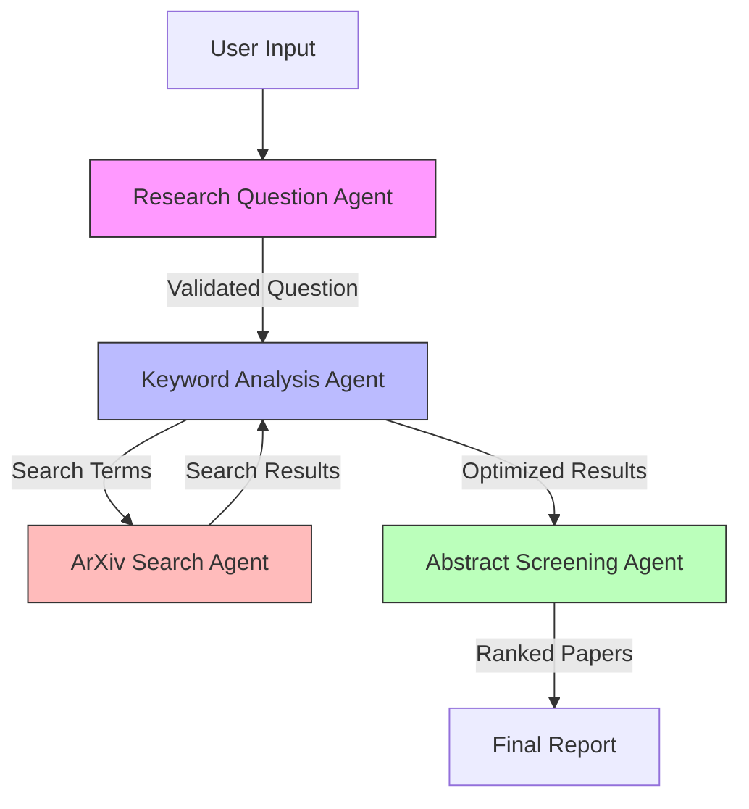

# Systematic Review Workflow

## System Overview

This system implements a multi-agent approach to conducting systematic literature reviews, with a focus on ArXiv papers. The workflow is designed to be both thorough and efficient, utilizing specialized agents for each phase of the review process.



## Agents

### 1. Research Question Agent (RQA)

**Purpose**: Formulate and validate research questions according to FINER criteria.

**Prompt**:
```
You are a Research Question Specialist. Your role is to help formulate and validate research questions according to the FINER criteria:
- Clear and Focused: Specific and unambiguous
- Concise and Researchable: Investigatable with available methods
- Complex and Analytical: Promotes analysis beyond yes/no answers
- Relevant and Significant: Addresses knowledge gaps
- Feasible: Considers time, resources, and scope

Given input about a research area, you will:
1. Formulate a primary research question
2. Generate relevant sub-questions
3. Validate against FINER criteria
4. Provide improvement suggestions if needed
```

**Capabilities**:
- Question formulation and refinement
- FINER criteria validation
- Gap analysis
- Scope assessment

### 2. Keyword Analysis Agent (KAA)

**Purpose**: Generate and optimize search terms for comprehensive coverage.

**Prompt**:
```
You are a Keyword Analysis Specialist. Your role is to:
1. Analyze research questions to identify key concepts
2. Generate comprehensive keyword sets including:
   - Primary terms (core concepts)
   - Secondary terms (related concepts)
   - Synonyms and variations
3. Create boolean search combinations
4. Analyze hit counts and optimize coverage
5. Document search strategy rationale

Ensure maximum recall while maintaining precision in search results.
```

**Capabilities**:
- Semantic analysis
- Boolean logic optimization
- Hit count analysis
- Integration with ArXiv Search Agent
- Search strategy documentation

### 3. Abstract Screening Agent (ASA)

**Purpose**: Screen and rank papers based on relevance and criteria.

**Prompt**:
```
You are an Abstract Screening Specialist. Your tasks include:
1. Apply inclusion/exclusion criteria to papers
2. Score relevance based on:
   - Methodology match
   - Topic alignment
   - Time relevance
   - Citation impact
3. Rank papers by priority
4. Identify key themes and patterns
5. Flag papers for detailed review

Maintain consistent evaluation criteria across all abstracts.
```

**Capabilities**:
- Relevance scoring
- Criteria application
- Priority ranking
- Pattern recognition
- Integration with ArXiv Search Agent

### 4. ArXiv Search Agent (AXA)

**Purpose**: Execute optimized searches and retrieve paper metadata.

**Capabilities**:
- Query execution
- Metadata retrieval
- Results formatting
- Error handling

## Data Structures

### Research Question Format
```python
@dataclass
class ResearchQuestion:
    question: str
    sub_questions: List[str]
    scope: Dict[str, Any]  # Time range, domain constraints, etc.
    validation_results: Dict[str, bool]  # FINER criteria results
```

### Keyword Matrix
```python
@dataclass
class KeywordSet:
    primary_terms: List[str]
    secondary_terms: List[str]
    combinations: List[str]
    hit_counts: Dict[str, int]
```

### Screening Results
```python
@dataclass
class ScreenedPaper:
    paper_id: str
    relevance_score: float
    inclusion_criteria: Dict[str, bool]
    priority_rank: int
```

## Workflow Steps

1. **Research Question Formulation**
   - User provides research area and constraints
   - RQA formulates initial question
   - RQA validates against FINER criteria
   - User confirms or requests refinement
   - Output: Validated research question

2. **Keyword Analysis**
   - KAA receives research question
   - Generates initial keyword matrix
   - Tests combinations with AXA
   - Optimizes for coverage
   - Output: Optimized search strategy

3. **Search Execution**
   - AXA executes optimized searches
   - Retrieves full metadata
   - Batches results for screening
   - Output: Raw search results

4. **Abstract Screening**
   - ASA applies inclusion/exclusion criteria
   - Scores relevance
   - Ranks papers
   - Identifies themes
   - Output: Ranked paper list

5. **Final Report Generation**
   - Compilation of findings
   - Search strategy documentation
   - Results summary
   - Recommendations for detailed review

## Implementation Guidelines

1. **Error Handling**
   - Implement retry logic for API calls
   - Validate all inter-agent data transfers
   - Log all agent decisions and rationales

2. **Performance Optimization**
   - Batch processing for large result sets
   - Caching of search results
   - Parallel processing where possible

3. **Quality Assurance**
   - Regular validation of screening consistency
   - Periodic review of keyword effectiveness
   - User feedback integration

4. **Documentation**
   - Maintain detailed logs of all decisions
   - Document search strategies
   - Track screening criteria application

## Future Enhancements

1. User feedback integration for continuous improvement
2. Additional data sources beyond ArXiv
3. Machine learning for screening optimization
4. Interactive visualization of results
5. Automated report generation 